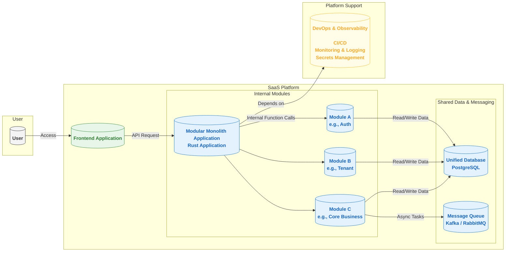

# 2. Technical Architecture Document

This document outlines the overall technical architecture of the system. The core objective of this architecture is to maximize development efficiency, simplify deployment and operations, and retain sufficient scalability for future business growth, all while ensuring functional integrity.

---

### **1. System Architecture Principles**

*   **Modular Monolith Architecture**: In the initial phase, we will adopt a "Modular Monolith" as the core architecture. Within a single application, code will be organized through clear module divisions (e.g., authentication, tenant management, core business). This approach allows us to enjoy the development and deployment efficiency of a monolith while laying a solid foundation for future evolution into microservices through enforced module boundaries.
*   **Cloud-Native Ready**: We will prioritize the use of managed services from cloud providers (e.g., databases, object storage) to achieve better elasticity, availability, and operational efficiency. The architecture will maintain good compatibility with cloud environments.
*   **High Availability and Disaster Recovery**: The overall architecture must support multi-availability zone deployment and be designed with automatic failover mechanisms to meet predefined RPO and RTO targets.
*   **Security First**: Security is a core part of the architecture and must be deeply designed at multiple levels, including network, application, and data.

### **2. Conceptual Architecture Diagram - Modular Monolith**

### **3. Tech Stack**

*   **Frontend Architecture**:
    *   **Framework**: **React** or **Vue**.
    *   **UI Component Library**: **Ant Design** or **Material-UI**.
    *   **Build Tool**: **Vite** or **Webpack**.
    *   **Communication**: The frontend communicates with the backend monolith application via REST API.

*   **Backend Language & Framework**:
    *   **Language**: **Rust**. Reason: It offers excellent performance, memory safety guarantees, and powerful concurrency handling, making it ideal for building a long-term, stable, and reliable SaaS system.
    *   **Framework**: **Axum** or **Actix Web**.

*   **Intra-Module Communication**:
    *   **Synchronous Communication**: Modules communicate via **direct function/method calls**, which offers the highest performance and simplest development and debugging.
    *   **Core Constraint**: Clear module interfaces (Rust Traits) must be defined. A module can only access another module's functionality through its interface. **Direct access to other modules' internal data structures or database tables is strictly forbidden**.
    *   **Asynchronous Communication**: A **message queue** is used for decoupling and handling time-consuming tasks (e.g., sending emails, generating reports).

*   **Containerization & Deployment**:
    *   **Containerization**: **Docker**. The entire monolith application is packaged into a single Docker image.
    *   **Deployment**: Initially, it can be deployed directly on a **virtual machine** or a **PaaS platform** (e.g., AWS App Runner, Heroku). This avoids complex container orchestration and keeps operational costs extremely low. **Kubernetes** is an option for future large-scale deployments.

*   **Data Layer**:
    *   **Relational Database**: **PostgreSQL**. Its Row-Level Security (RLS) feature is recommended to enhance multi-tenant data isolation.
    *   **Database Migration**: Use tools like **Refinery** (native Rust) or **Flyway** to manage database schema changes.
    *   **Non-relational Databases**:
        *   **Redis**: For high-performance caching.
        *   **Elasticsearch**: For advanced search and log management.
    *   **Object Storage**: **AWS S3** or S3-compatible storage (e.g., MinIO) for file storage.

*   **Observability**:
    *   **Monitoring & Alerting**: **Prometheus** + **Grafana**.
    *   **Log Management**: **ELK Stack** or **Loki** + **Fluentd**.
    *   **Distributed Tracing**: **Not essential** initially. Introduce **Jaeger** or **Zipkin** only when microservices are split out in the future.

*   **CI/CD**: **GitLab CI/CD**, **Jenkins**, or **GitHub Actions**.

### **4. Key Design Decisions**

#### **4.1 Architectural Core: Modular Monolith and Evolution Strategy**

The core of this architecture is the "Modular Monolith," which aims to balance current development efficiency with future scalability.

*   **Module Definition**: Each business domain (e.g., authentication, billing, notifications) is defined as a separate Rust module (`mod`). Each module has a clear `api.rs` or `lib.rs` file that exposes its public interface (Traits and Structs).
*   **Boundary Enforcement**: Dependencies between modules must be unidirectional and follow the principles of high cohesion and low coupling. Code reviews and static analysis tools should ensure that module boundaries are not violated.
*   **Evolution Path**: When a module needs to be deployed independently, it can be smoothly evolved into a microservice following these steps:
    1.  Migrate the module's code to a new Cargo project.
    2.  Create a separate database schema or instance for it.
    3.  Replace the original internal function calls with network API calls (e.g., REST or gRPC).
    4.  Update the calling logic in the main application to point to the new microservice.
    This process is transparent to other modules, enabling a low-risk, incremental architectural evolution.

#### **4.2 Multi-Tenancy Isolation Strategy**

*   **Data Isolation**: **Shared database, shared schema, with a `tenant_id` field in business tables**. The data access layer must automatically inject a `WHERE tenant_id = ?` condition into all SQL queries. It is strongly recommended to use **PostgreSQL's Row-Level Security (RLS)** to enforce this rule at the database level.
*   **Storage and Cache Isolation**: Use a `tenant_id`-based directory prefix for object storage; cache keys must include the `tenant_id`.
*   **Performance Isolation**: Initially managed through proper resource allocation. More complex rate-limiting or resource queuing mechanisms can be introduced in the future.

#### **4.3 Secrets Management Strategy**

*   All sensitive information (database passwords, API keys, etc.) is **strictly forbidden** from being hard-coded.
*   A dedicated secrets management service (like **HashiCorp Vault** or a cloud provider's **KMS**) must be used for centralized management.

---

### **5. Environment Strategy**

To ensure the quality and stability of development and releases, the system will maintain the following environments:
*   **Development**: For developers' local development and debugging.
*   **Testing/QA**: Deploys the latest development version for running automated tests and functional verification by the QA team.
*   **Staging**: A mirror of the production environment for final regression testing before going live.
*   **Production**: The official service environment for end-users.