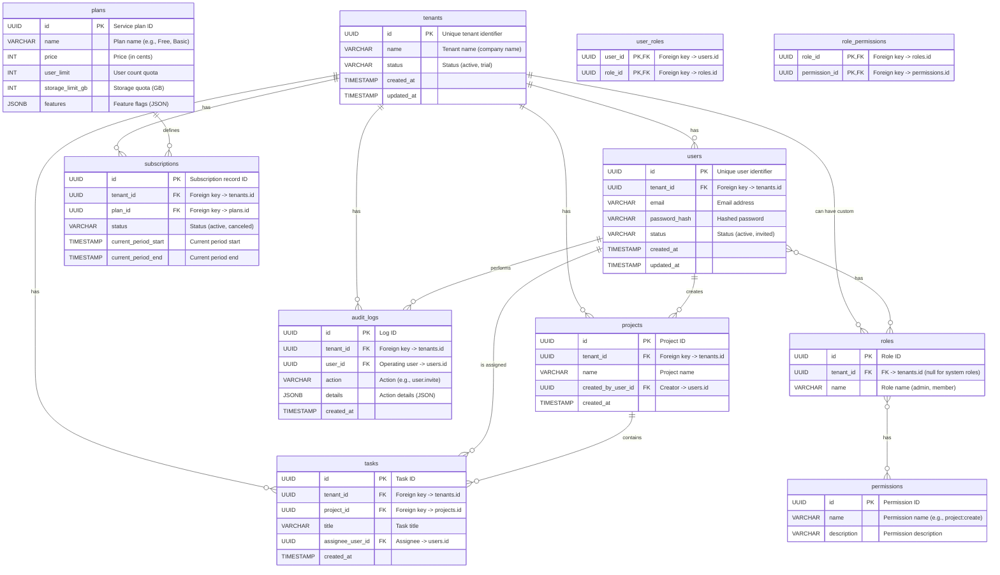

# 4. Database Design Document

This document, based on the "Multi-Tenant SaaS System Core Functional Design" and "Technical Architecture Document," describes the database design for the SaaS platform, focusing on the multi-tenant data isolation strategy and the structure of core tables.

---

### **1. Database Selection**

*   **Primary Database**: **PostgreSQL**
*   **Reasoning**:
    *   A mature, open-source relational database that is powerful and stable.
    *   Built-in **Row-Level Security (RLS)** feature, which is ideal for implementing multi-tenant data isolation by enforcing data access policies at the database level.
    *   Supports rich data types, such as `JSONB`, for storing semi-structured data.
    *   Offers excellent scalability.

### **2. Multi-Tenant Data Isolation Strategy**

*   **Core Strategy**: **Shared Database, Shared Schema, with data isolated by a `tenant_id` field**.
*   **Implementation Details**:
    1.  Almost all business data tables that need to be tenant-specific must include a field named `tenant_id`.
    2.  The `tenant_id` field will be of type `UUID` or `BIGINT` and will have a foreign key relationship to the `tenants` table.
    3.  An index will be created on this field to optimize the performance of querying data by tenant.
    4.  **Mandatory Requirement**: The application's data access layer (ORM or custom DAL) must automatically inject a `WHERE tenant_id = 'current_user_tenant_id'` condition into all `SELECT`, `UPDATE`, and `DELETE` operations.
    5.  **Security Enhancement**: In PostgreSQL, enable **Row-Level Security (RLS)** for all tenant-related tables. This will serve as a final line of defense, preventing cross-tenant data leaks even if there are vulnerabilities in the application code.

### **3. Core Table Structure Design (ER Diagram)**



#### **Table Structure Explanation**

*   **`tenants`**: The core table of the system, holding the root record for every tenant.
*   **`users`**: Stores all users, strictly belonging to a tenant via `tenant_id`.
    *   **Constraint**: A composite unique index must be created on `(tenant_id, email)`.
*   **`plans`**: New. Defines the different service tiers of the SaaS product (e.g., Free, Basic, Enterprise), including price, quotas (user count, storage), and feature flags.
*   **`subscriptions`**: Records which tenant is subscribed to which plan, along with the subscription's validity period and status.
*   **RBAC (Role-Based Access Control) Related Tables**: New.
    *   **`roles`**: Role definitions. `tenant_id` can be NULL, indicating a system-preset global role. Tenants can also create their own custom roles.
    *   **`permissions`**: Permission definitions, defining atomic operations in the system (e.g., `project:create`, `user:invite`).
    *   **`user_roles`** / **`role_permissions`**: Junction tables implementing the many-to-many relationship between users, roles, and permissions, providing great flexibility.
*   **`audit_logs`**: New. Records all significant user actions, crucial for security and compliance.
*   **`projects` / `tasks`**: Example business tables, demonstrating how business data is associated with `tenant_id`.

### **4. Indexes, Constraints, and SQL Examples**

#### **4.1 Indexing Strategy**

*   **Primary Keys**: All tables should have a primary key, preferably using `UUID` to avoid ID guessing or collisions in a distributed environment.
*   **Foreign Keys**: Foreign key constraints must be established for all entity relationships to ensure data referential integrity.
*   **`tenant_id` Index**: **All tables containing `tenant_id` must have a B-Tree index on that column**. This is fundamental to multi-tenant query performance.
*   **Composite Indexes**:
    *   On the `users` table, create a composite unique index on `(tenant_id, email)` to ensure email uniqueness within the same tenant.
    *   Create other composite indexes based on common query patterns. For example, if you frequently query for tasks of a specific status within a project, create an index on `(project_id, status)` in the `tasks` table.

#### **4.2 Row-Level Security (RLS) Policy Example**

RLS is a core safeguard for multi-tenant security. Here is an example of how to enable RLS for the `projects` table:

1.  **Enable RLS on the table**:
    ```sql
    ALTER TABLE projects ENABLE ROW LEVEL SECURITY;
    ```

2.  **Create the policy**:
    This policy allows users to access rows in the `projects` table that match their own `tenant_id`.
    ```sql
    CREATE POLICY tenant_isolation_policy ON projects
    FOR ALL
    USING (tenant_id = current_setting('app.current_tenant_id')::UUID);
    ```

3.  **Application**:
    At the beginning of each database connection, the application must set the tenant ID for the current session:
    ```sql
    -- In the application code, execute this for each request's database connection
    SET app.current_tenant_id = 'current_logged_in_user_tenant_id'; 
    ```
    Once this is set, all queries to the `projects` table will be automatically filtered by the database, without needing to manually add a `WHERE` clause in the application layer.

#### **4.3 Multi-Tenant Query Example**

A typical query to get all projects for a tenant and their creators' emails:
```sql
-- Set the tenant ID for the current session (done by the application on connection)
SET app.current_tenant_id = 'a1b2c3d4-e5f6-7890-1234-567890abcdef';

-- Execute the query (no need to specify tenant_id in the WHERE clause again)
SELECT 
    p.name AS project_name,
    u.email AS creator_email
FROM 
    projects p
JOIN 
    users u ON p.created_by_user_id = u.id;
-- The RLS policy will automatically apply "WHERE p.tenant_id = 'a1b2c3d4-...' AND u.tenant_id = 'a1b2c3d4-...'" to the query
```

### **5. Backup and Recovery**

*   **Backup Strategy**:
    *   Enable PostgreSQL's Point-in-Time Recovery (PITR).
    *   Perform daily full data snapshot backups.
    *   Backup data must be stored off-site.
*   **Recovery Plan**:
    *   A detailed disaster recovery plan must be established and rehearsed regularly.
    *   Clearly define RPO (Recovery Point Objective) and RTO (Recovery Time Objective).