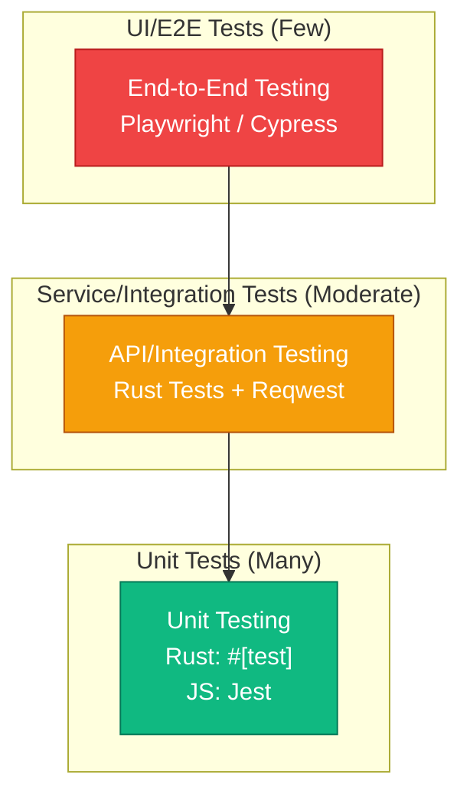

# 5. Testing Documents

This document, based on the "Multi-Tenant SaaS System Core Functional Design" and related requirements and architecture documents, aims to plan the testing strategy, scope, and key test cases for the SaaS platform.

---

### **1. Testing Strategy and Model**

#### **1.1 Testing Objectives**

*   **Core Objective**: To ensure the **correctness** of platform functions, the **security** of multi-tenant data, the **stability** of the system, and a good **user experience**.
*   **Quality Policy**: Vigorously promote automated testing and shift-left testing to achieve fast, high-quality continuous delivery.

#### **1.2 The Test Pyramid Model**

We adopt the classic "Test Pyramid" model to guide the allocation of testing resources. This means our testing investment should be shaped like a pyramid, broad at the base and narrow at the top.

*   **Base of the Pyramid - Unit Tests**:
    *   **Quantity**: The most.
    *   **Speed**: The fastest.
    *   **Cost**: The lowest.
    *   **Purpose**: To verify the logical correctness of individual functions or components. This is the foundation of code quality.

*   **Middle of the Pyramid - Integration Tests**:
    *   **Quantity**: Moderate.
    *   **Speed**: Medium.
    *   **Cost**: Medium.
    *   **Purpose**: To verify that interactions between modules or services are correct, especially the contracts of API interfaces.

*   **Top of the Pyramid - End-to-End (E2E) Tests**:
    *   **Quantity**: The fewest.
    *   **Speed**: The slowest.
    *   **Cost**: The highest.
    *   **Purpose**: To simulate real user scenarios and verify that the entire system's business flows are smooth. Covers only the most critical user journeys.

### **2. Test Types and Tool Stack**

#### **2.1 Unit Testing**

*   **Scope**: The smallest testable units in the code (functions, methods, components).
*   **Owner**: Developers.
*   **Backend (Rust)**:
    *   **Tools**: Use Rust's built-in testing framework (`#[test]`).
    *   **Focus**: Cover core algorithms, business logic, and data structure validation.
*   **Frontend (React/Vue)**:
    *   **Tools**: **Jest** + **React Testing Library** / **Vue Test Utils**.
    *   **Focus**: Cover the rendering, event responses, and state changes of individual UI components.

#### **2.2 Integration Testing**

*   **Scope**: Interactions between modules and services.
*   **Owner**: Developers / Testers.
*   **Backend API Testing**:
    *   **Tools**: Use the Rust testing framework combined with libraries like `reqwest` or `isahc` to send HTTP requests and assert API responses.
    *   **Focus**: Cover all API endpoints for normal requests, invalid parameters, and boundary conditions.
*   **Database Integration Testing**:
    *   **Tools**: **Testcontainers** for Rust. This allows dynamically starting a real PostgreSQL Docker container during tests to test the data access layer, ensuring the correctness of SQL queries and `tenant_id` logic.

#### **2.3 End-to-End (E2E) Testing**

*   **Scope**: Simulating real users, covering complete business flows from the UI through the backend to the database.
*   **Owner**: Testers / Automation Engineers.
*   **Tools**: **Playwright** (recommended) or **Cypress**.
*   **Focus**: Cover only the most critical business scenarios, such as registration, login, core functional operations, subscription changes, etc.

### **3. Test Objectives and Quality Gates**

To quantify quality standards, we define the following metrics as "quality gates" in our CI/CD pipeline. Builds that do not meet these standards will be considered failed and will not be allowed to proceed to the next stage.

*   **Code Coverage**:
    *   **Target**: Unit test code coverage for core business modules **must be > 80%**.
    *   **Tools**: `cargo-tarpaulin` (for Rust), `Jest --coverage` (for JS).
    *   **Gate**: The CI pipeline will fail if coverage is below the target.

*   **Automated Test Pass Rate**:
    *   **Target**: All levels of automated tests (unit, integration, E2E) **must pass 100%**.
    *   **Gate**: The failure of any single test case will block code merging or deployment.

*   **Static Code Analysis**:
    *   **Target**: No high-risk vulnerabilities or severe code smells in the code.
    *   **Tools**: `Clippy` (for Rust), `ESLint` (for JS).
    *   **Gate**: The `cargo clippy -- -D warnings` and `eslint` commands must exit without errors.

*   **Performance Baseline**:
    *   **Target**: The P95 response time for core APIs (e.g., login, main data query) under a baseline load **must be < 300ms**.
    *   **Tools**: k6, JMeter, etc.
    *   **Gate**: Automated performance tests are run periodically in the staging environment. A significant performance degradation will trigger an alert and require analysis.

### **4. Key Test Scenario Design**

#### **4.1 Multi-Tenant Isolation and Security Testing (Highest Priority)**

This is the lifeline of the SaaS platform and must be tested most rigorously and comprehensively.

*   **Scenario 1: Data Read Isolation (Horizontal Privilege Escalation)**
    *   **Description**: A user from Tenant A must never be able to read data from Tenant B.
    *   **Steps**:
        1.  Create project `P_A` in Tenant A.
        2.  Create project `P_B` in Tenant B.
        3.  Log in as a user from Tenant A and obtain their JWT token.
        4.  Use this token to directly request the ID of project `P_B` via the API.
    *   **Expected Result**: The API must return `404 Not Found` (recommended) or `403 Forbidden`. It must never return any information about `P_B`.

*   **Scenario 2: Data Write/Modify Isolation (Horizontal Privilege Escalation)**
    *   **Description**: A user from Tenant A must never be able to modify or delete data from Tenant B.
    *   **Steps**:
        1.  Continuing from Scenario 1, use the token of the user from Tenant A.
        2.  Attempt to modify the name of project `P_B` or delete `P_B` via the API.
    *   **Expected Result**: The API must return `404 Not Found` or `403 Forbidden`. The data for `P_B` in the database must remain unchanged.

*   **Scenario 3: User Role and Permission Isolation (Vertical Privilege Escalation)**
    *   **Description**: Within the same tenant, a user with lower privileges cannot perform actions requiring higher privileges.
    *   **Steps**:
        1.  In Tenant A, create an `admin` user and a `member` user.
        2.  The `member` role does not have the "delete project" permission.
        3.  Log in as the `member` user and obtain their JWT token.
        4.  Use this token to call the API to delete project `P_A`.
    *   **Expected Result**: The API must return `403 Forbidden`.

*   **Scenario 4: Tenant Wall in User Invitation Flow**
    *   **Description**: An admin from Tenant A cannot affect Tenant B through the "invite user" feature.
    *   **Steps**:
        1.  A user `user@b.com` already exists in Tenant B.
        2.  The admin of Tenant A attempts to invite `user@b.com` to join Tenant A.
    *   **Expected Result**: The system should handle this correctly. A recommended approach: allow the invitation. After logging in, user `user@b.com` will have a "tenant switcher" option. It needs to be verified that their permissions in Tenant A are completely isolated from their permissions in Tenant B after switching.

*   **Scenario 5: Subscription Quota Limits**
    *   **Description**: A user's actions cannot exceed the quota limits of their subscription plan.
    *   **Steps**:
        1.  Tenant A is subscribed to the "Basic" plan with a user limit of 10.
        2.  The admin of Tenant A has successfully invited 9 members (totaling 10 users).
        3.  The admin attempts to invite an 11th member.
    *   **Expected Result**: Both the UI and the API should clearly indicate "User limit reached" and prevent the invitation.

#### **4.2 Core Functional Flow Testing**

*   **Scenario 6: New Tenant Onboarding**
    *   **Description**: Verify the entire flow from signing up on the website to entering the application.
    *   **Focus**: The validity of the email verification link and whether the initial setup wizard correctly configures tenant information.

*   **Scenario 7: Subscription Plan Changes (Upgrade/Downgrade)**
    *   **Description**: Verify that after a user changes their subscription plan, the features and quotas take effect immediately (or in the next cycle).
    *   **Focus**: After an upgrade, are new features immediately available? After a downgrade, are old premium features correctly disabled?

#### **4.3 Non-Functional Testing**

*   **Performance Testing**:
    *   **"Noisy Neighbor" Test**: Simulate Tenant A making a large number of high-load API requests (e.g., complex report queries). Continuously monitor the response time of Tenant B's core APIs to ensure performance jitter is within an acceptable range (e.g., < 20%).
*   **Security Testing**:
    *   **Vulnerability Scanning**: Use automated tools (like OWASP ZAP) to scan for common web vulnerabilities.
    *   **Penetration Testing**: Periodically conduct penetration tests by internal or third-party security teams, focusing on the possibility of bypassing tenant data isolation.