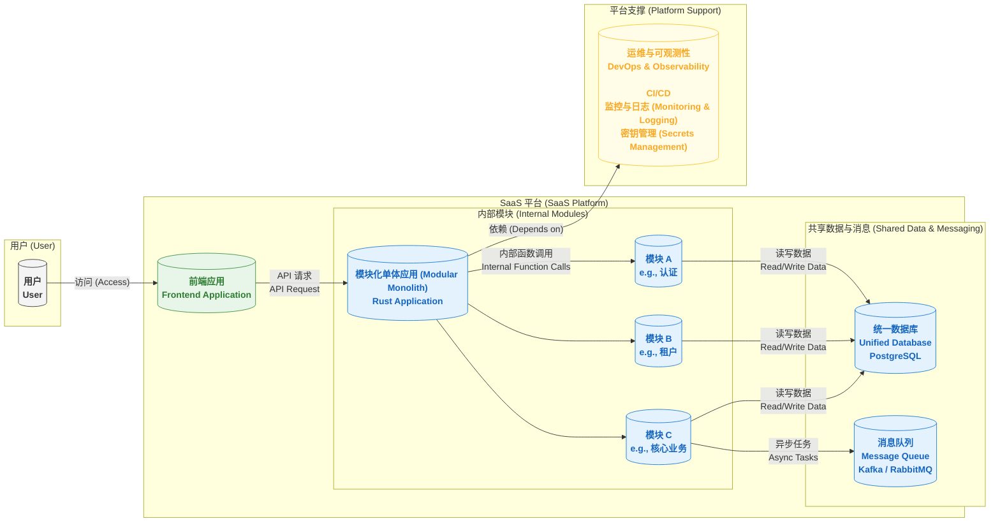

# 2. 技术架构文档 (Technical Architecture Document)

本文档旨在阐述系统的整体技术架构。该架构的核心目标是在保证功能完整性的前提下，最大化开发效率、简化部署运维，并为未来的业务增长保留充足的扩展能力。

---

### **1. 系统架构原则**

*   **模块化单体架构 (Modular Monolith Architecture)**: 初期采用“模块化单体”作为核心架构。在单个应用程序内部，通过清晰的模块划分（如认证、租户管理、核心业务）来组织代码。这既能享受单体应用带来的开发和部署效率，又能通过强制的模块边界为未来向微服务演进打下坚实基础。
*   **云原生就绪 (Cloud-Native Ready)**: 优先采用云服务提供商的托管服务（如数据库、对象存储），以获得更好的弹性、可用性和运维效率。架构设计将保持对云环境的良好兼容性。
*   **高可用与灾备**: 整体架构需支持多可用区部署，并设计自动故障转移机制，以满足预定的RPO和RTO目标。
*   **安全第一 (Security First)**: 安全性是架构的核心部分，必须在网络、应用、数据等多个层面进行深度设计。

### **2. 架构组件图 (Conceptual) - 模块化单体**

### **3. 技术栈选型 (Tech Stack)**

*   **前端架构 (Frontend Architecture)**:
    *   **框架**: **React** 或 **Vue**。
    *   **UI组件库**: **Ant Design** 或 **Material-UI**。
    *   **构建工具**: **Vite** 或 **Webpack**。
    *   **通信方式**: 前端通过 REST API 与后端单体应用通信。

*   **后端语言与框架 (Backend Language & Framework)**:
    *   **语言**: **Rust**。理由：具备卓越的性能、内存安全保证和���大的并发处理能力，非常适合构建长期、稳定、可靠的SaaS系统。
    *   **框架**: **Axum** 或 **Actix Web**。

*   **模块间通信 (Intra-Module Communication)**:
    *   **同步通信**: 模块间通过**直接的函数/方法调用**进行，性能最高，开发调试最简单。
    *   **核心约束**: 必须定义清晰的模块接口（Rust Traits）。一个模块只能通过接口访问另一个模块的功能，**严禁直接访问其他模块的内部数据结构或数据库表**。
    *   **异步通信**: 采用**消息队列**进行解耦，处理耗时任务（如发送邮件、生成报告）。

*   **容器化与部署 (Containerization & Deployment)**:
    *   **容器化**: **Docker**。将整个单体应用打包成一个独立的Docker镜像。
    *   **部署**: 初期可直接部署在**虚拟机**或**PaaS平台**（如AWS App Runner, Heroku）。无需复杂的容器编排，运维成本极低。**Kubernetes**可作为未来大规模部署时的选项。

*   **数据层 (Data Layer)**:
    *   **关系型数据库**: **PostgreSQL**。推荐使用其行级安全（RLS）特性来增强多租户数据隔离。
    *   **数据库迁移**: 使用 **Refinery** (Rust原生) 或 **Flyway** 等工具管理数据库Schema的变更。
    *   **非关系型数据库**:
        *   **Redis**: 用于高性能缓存。
        *   **Elasticsearch**: 用于高级搜索和日志管理。
    *   **对象存储**: **AWS S3** 或兼容S3的存储（如MinIO），用于存储文件。

*   **可观测性 (Observability)**:
    *   **监控与告警**: **Prometheus** + **Grafana**。
    *   **日志管理**: **ELK Stack** 或 **Loki** + **Fluentd**。
    *   **分布式追踪**: 初期**非必需**。仅在未来拆分出微服务后，才引入 **Jaeger** 或 **Zipkin**。

*   **CI/CD**: **GitLab CI/CD**, **Jenkins**, 或 **GitHub Actions**。

### **4. 关键设计决策**

#### **4.1 架构核心：模块化单体与演进策略**

本架构的核心是“模块化单体”，它旨在平衡当前开发效率和未来扩展性。

*   **模块定义**: 每个业务领域（如认证、计费、通知）都被定义为一个独立的Rust模块 (`mod`)。每个模块都有一个清晰的 `api.rs` 或 `lib.rs` 文件，用于暴露其公共接口 (Traits and Structs)。
*   **边界强制**: 模块间的依赖关系必须是单向的，并遵循高内聚、低耦合原则。代码审查和静态分析工具应确保模块边界不被破坏。
*   **演进路径**: 当某个模块需要独立部署时，可按以下步骤平滑演进为微服务：
    1.  将该模块的代码迁移到一个新的Cargo项目中。
    2.  为其创建独立的数据库Schema或数据库实例。
    3.  将原有的内部函数调用替换为网络API调用（如REST或gRPC）。
    4.  在主应用中更新调用方式，指向新的微服务。
    这个过程对其他模块是透明的，从而实现了低风险、渐进式的架构演进。

#### **4.2 多租户隔离策略**

*   **数据隔离**: **共享数据库，共享Schema，业务表包含 `tenant_id` 字段**。在数据访问层自动为所有SQL查询注入 `WHERE tenant_id = ?` 条件。强烈建议利用 **PostgreSQL的行级安全策略 (RLS)** 在数据库层面强制执行此规则。
*   **存储与缓存隔离**: 对象存储使用基于 `tenant_id` 的目录前缀；缓存键（Cache Key）必须包含 `tenant_id`。
*   **性能隔离**: 初期通过合理的资源配置进行规避。未来可引入更复杂的限流或资源队列机制。

#### **4.3 密钥管理策略 (Secrets Management)**

*   所有敏感信息（数据库密码、API密钥等）**严禁**硬编码。
*   必须采用专门的密钥管理服务（如 **HashiCorp Vault** 或云厂商的 **KMS**）进行统一管理。

---

### **5. 环境策略 (Environment Strategy)**

为保证开发和发布的质量与稳定性，系统将维护以下几套环境：
*   **开发环境 (Development)**: 开发人员本地的开发和调试环境。
*   **测试环境 (Testing/QA)**: 部署最新开发版本，用于运行自动化测试和QA团队的功能验证。
*   **预生产环境 (Staging)**: 生产环境的镜像，用于上线前的最终回归测试。
*   **生产环境 (Production)**: 面向最终用户的正式服务环境。
