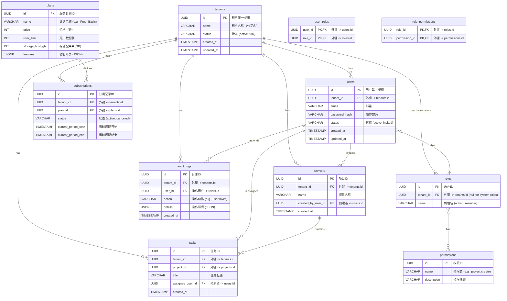

# 4. 数据库设计文档 (Database Design Document)

本文档基于《多租户SaaS系统基础功能设计》和《技术架构文档》，详细描述了SaaS平台的数据库设计，重点关注多租户数据隔离策略和核心表的结构。

---

### **1. 数据库选型**

*   **主数据库**: **PostgreSQL**
*   **选型理由**:
    *   成熟的开源关系型数据库，功能强大且稳定。
    *   内置**行级安全 (Row-Level Security, RLS)** 功能，是实现多租户数据隔离的理想选择，可以在数据库层面强制执行数据访问策略。
    *   支持丰富的数���类型，如 `JSONB`，便于存储半结构化数据。
    *   具备良好的可扩展性。

### **2. 多租户数据隔离策略**

*   **核心策略**: **共享数据库，共享 Schema，通过 `tenant_id` 字段隔离数据**。
*   **实施细则**:
    1.  在几乎所有需要区分租户的业务数据表中，都必须包含一个名为 `tenant_id` 的字段。
    2.  `tenant_id` 字段的类型为 `UUID` 或 `BIGINT`，并建立外键关联到 `tenants` 表。
    3.  在该字段上建立索引，以优化按租户查询数据的性能。
    4.  **强制性要求**: 应用程序的数据访问层��ORM或自定义DAL）必须在所有 `SELECT`, `UPDATE`, `DELETE` 操作中自动注入 `WHERE tenant_id = '当前用户的租户ID'` 的条件。
    5.  **安全增强**: 在PostgreSQL中，为所有租户相关的表启用**行级安全策略 (RLS)**。这将作为最后一道防线，即使应用程序代码存在漏洞，也能防止数据跨租户泄露。

### **3. 核心表结构设计 (ER Diagram)**



#### **表结构说明**

*   **`tenants` (租户表)**: 系统的核心，所有租户的根记录。
*   **`users` (用户表)**: 存储所有用户，通过 `tenant_id` 严格归属于某个租户。
    *   **约束**: `(tenant_id, email)` 必须建立复合唯一索引。
*   **`plans` (服务计划表)**: 新增。用于定义SaaS产品的不同服务等级（如免费版、基础版、企业版），包含价格、配额（用户数、存储容量）和功能开关等。
*   **`subscriptions` (订阅表)**: 记录哪个租户订阅了哪个服务计划，以及订阅的有效期和状态。
*   **RBAC (Role-Based Access Control) 相关表**: 新增。
    *   **`roles`**: 角色定义表。`tenant_id` 可以为NULL，代表是系统预设的全局角色。租户也可以创建自己的自定义角色。
    *   **`permissions`**: 权限定义表，定义了系统中有哪些原子操作（如 `project:create`, `user:invite`）。
    *   **`user_roles`** / **`role_permissions`**: 关联表，实现了用户-角色-权限的多对多关系，提供了极高的灵活性。
*   **`audit_logs` (审计日志表)**: 新增。用于记录所有重要的用户操作，是安全和合规的关键。
*   **`projects` / `tasks`**: 业务表示例，展示了业务数据如何与 `tenant_id` 关联。

### **4. 索引、约束与SQL示例**

#### **4.1 索引策略**

*   **主键 (Primary Keys)**: 所有表都应有主键，推荐使用 `UUID` 以避免ID在分布式环境中被猜测或冲突。
*   **外键 (Foreign Keys)**: 必须为所有实体间的关联建立外键约束，以保证数据的引用完整性。
*   **`tenant_id` 索引**: **所有包含 `tenant_id` 的表都必须在该列上建立B-Tree索引**。这是多租户查询性能的根本保证。
*   **复合索引**:
    *   在 `users` 表上，为 `(tenant_id, email)` 创建复合唯一索引，确保同一租户内邮箱的唯一性。
    *   根据常见查询模式创建其他复合索引。例如，如果经常查询某个项目下的特定状态任务，可以在 `tasks` 表上为 `(project_id, status)` 建立索引。

#### **4.2 行级安全 (RLS) 策略示例**

RLS是多租户安全的核心保障。以下是如何为 `projects` 表启用RLS的示例：

1.  **在表上启用RLS**:
    ```sql
    ALTER TABLE projects ENABLE ROW LEVEL SECURITY;
    ```

2.  **创建策略**:
    该策略允许用户访问 `projects` 表中与自己 `tenant_id` 相同的行。
    ```sql
    CREATE POLICY tenant_isolation_policy ON projects
    FOR ALL
    USING (tenant_id = current_setting('app.current_tenant_id')::UUID);
    ```

3.  **应用**:
    在每个数据库连接的开始，应用程序必须设置当前会话的租户ID：
    ```sql
    -- 在应用代码中，为每个请求的数据库连接执行此操作
    SET app.current_tenant_id = '当前登录用户的租户ID'; 
    ```
    完成此设置后，所有对 `projects` 表的查询都会被数据库自动过滤，无需在应用层手动添加 `WHERE` 条件。

#### **4.3 多租户查询示例**

一个典型的查询，获取某个租户的所有项目及其创建者的邮箱：
```sql
-- 设置当前会话的租户ID (由应用在连接时完成)
SET app.current_tenant_id = 'a1b2c3d4-e5f6-7890-1234-567890abcdef';

-- 执行查询 (无需在WHERE子句中再次指定tenant_id)
SELECT 
    p.name AS project_name,
    u.email AS creator_email
FROM 
    projects p
JOIN 
    users u ON p.created_by_user_id = u.id;
-- RLS策略会自动将 "WHERE p.tenant_id = 'a1b2c3d4-...' AND u.tenant_id = 'a1b2c3d4-...'" 应用于查询
```


### **5. 备份与恢复**

*   **备份策略**:
    *   启用PostgreSQL的持续归档 (Point-in-Time Recovery, PITR)。
    *   每日进行全量数据��快照备份。
    *   备份数据需异地存储。
*   **恢复计划**:
    *   需制定详细的灾难恢复计划，并定期进行演练。
    *   明确RPO（恢复点目标）和RTO（恢复时目标）。