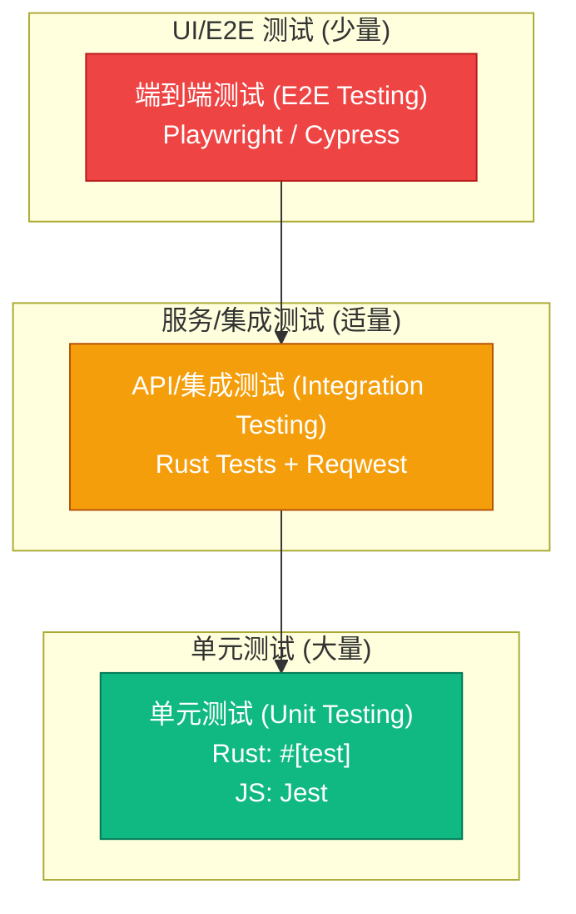

# 5. 测试文档 (Testing Documents)

本文档基于《多租户SaaS系统基础功能设计》以及相关的需求和架构文档，旨在规划SaaS平台的测试策略、范围和关键测试用例。

---

### **1. 测试策略与模型**

#### **1.1 测试目标**

*   **核心目标**: 确保平台功能的**正确性**、多租户数据的**安全性**、系统的**稳定性**和良好的**用户体验**。
*   **质量方针**: 大力推行自���化测试，左移测试，实现快速、高质量的持续交付。

#### **1.2 测试金字塔模型**

我们采用经典的“测试金字塔”模型来指导测试资源的分配。这意味着我们的测试投入应该呈金字塔形，底部宽，顶部窄。

*   **金字塔底部 - 单元测试 (Unit Tests)**:
    *   **数量**: 最多。
    *   **速度**: 最快。
    *   **成本**: 最低。
    *   **目的**: 验证单个函数或组件的逻辑正确性。这是保证代码质量的基石。

*   **金字塔中部 - 集成测试 (Integration Tests)**:
    *   **数量**: 适量。
    *   **速度**: 中等。
    *   **成本**: 中等。
    *   **目的**: 验证模块之间或���务之间的交互是否正确，特别是API接口的契约。

*   **金字塔顶部 - 端到端测试 (E2E Tests)**:
    *   **数量**: 最少。
    *   **速度**: 最慢。
    *   **成本**: 最高。
    *   **目的**: 模拟真实用户场景，验证整个系统的业务流程是否通畅。只覆盖最关键的用户旅程。

### **2. 测试类型与工具栈**

#### **2.1 单元测试 (Unit Testing)**

*   **范围**: 代码中的最小可测试单元（函数、方法、组件）。
*   **负责人**: 开发人员。
*   **后端 (Rust)**:
    *   **工具**: 使用Rust内置的测试框架 (`#[test]`)。
    *   **要点**: 覆盖核心算法、业务逻辑、数据结构验证。
*   **前端 (React/Vue)**:
    *   **工具**: **Jest** + **React Testing Library** / **Vue Test Utils**。
    *   **要点**: 覆盖单个UI组件的渲染、事件响应和状态变化。

#### **2.2 集成测试 (Integration Testing)**

*   **范围**: 模块间、服务间的交互。
*   **负责人**: 开发人员 / 测试人员。
*   **后端API测试**:
    *   **工具**: 使用Rust测试框架结合 `reqwest` 或 `isahc` 库来发送HTTP请求，断言API的响应。
    *   **要点**: 覆盖所有API端点的正常请求、异常参数和边界条件。
*   **数据库集成测试**:
    *   **工具**: **Testcontainers** for Rust。可以在测试运行时动态启动一个真实的PostgreSQL Docker容器，进行数据访问层的测试，确保SQL查询和 `tenant_id` 逻辑的正确性。

#### **2.3 端到端测试 (End-to-End Testing)**

*   **范围**: 模拟真实用户，贯穿UI、后端到数据库的完整业务流程。
*   **负责人**: 测试人员 / 自动化工程师。
*   **工具**: **Playwright** (推荐) 或 **Cypress**。
*   **要点**: 只覆盖最核心的业务场景，如注册、登录、核心功能操作、订阅变更等。

### **3. 测试目标与质量门禁**

为了将质量标准量化，我们定义以下指标作为CI/CD流水线中的“质量门禁”。不满足这些标准的构建将被视为失败，不允许进入下一个环节。

*   **代码覆盖率 (Code Coverage)**:
    *   **目标**: 核心业务模块的单元测试代码覆盖率 **必须 > 80%**。
    *   **工具**: `cargo-tarpaulin` (for Rust), `Jest --coverage` (for JS)。
    *   **门禁**: 如果覆盖率低于目标，CI流水线将失败。

*   **自动化测试通过率**:
    *   **目标**: 所有级别的自动化测试（单元、集成、E2E）**必须 100% 通过**。
    *   **门禁**: 任何一个测试用例失败，都将阻塞代码合并或部署。

*   **静态代码分析 (Static Code Analysis)**:
    *   **目标**: 代码中无高风险的漏洞、无严重的代码异味 (Code Smell)。
    *   **工具**: `Clippy` (for Rust), `ESLint` (for JS)。
    *   **门禁**: `cargo clippy -- -D warnings` 和 `eslint` 命令必须无错误退出。

*   **性能基线 (Performance Baseline)**:
    *   **目标**: 核心API（如登录、主数据查询��在基准负载下的P95响应时间 **必须 < 300ms**。
    *   **工具**: k6, JMeter等。
    *   **门禁**: 在预生产环境中定期运行自动化性能测试，如果性能显著下降，则触发告警并需要分析原因。

### **4. 关键测试场景设计**

### **4. 关键测试场景设计**

#### **4.1 多租户隔离与安全性测试 (最高优先级)**

这是SaaS平台的生命线，必须进行最严格、最全面的测试。

*   **场景1: 数据读取隔离 (水平越权)**
    *   **描述**: 租户A的用户，绝不能���取到租户B的数据。
    *   **步骤**:
        1.  在租户A中创建项目 `P_A`。
        2.  在租户B中创建项目 `P_B`。
        3.  使用租户A的用户登录，获取其JWT令牌。
        4.  使用此令牌，通过API直接请求项目 `P_B` 的ID。
    *   **预期**: API必须返回 `404 Not Found` (推荐) 或 `403 Forbidden`。绝不能返回 `P_B` 的任何信息。

*   **场景2: 数据写入/修改隔离 (水平越权)**
    *   **描述**: 租户A的用户，绝不能修改或删除租户B的数据。
    *   **步骤**:
        1.  接续场景1，使用租户A用户的令牌。
        2.  尝试通过API修改项目 `P_B` 的名称或删除 `P_B`。
    *   **预期**: API必须返回 `404 Not Found` 或 `403 Forbidden`。数据库中 `P_B` 的数据无任何变化。

*   **场景3: 用户角色与权限隔离 (垂直越权)**
    *   **描述**: 同一租户内，低权限用户不能执行高权限操作。
    *   **步骤**:
        1.  在租户A中，创建 `admin` 用户和 `member` 用户。
        2.  `member` 角色没有“删除项目”的权限。
        3.  使用 `member` 用户登录，获取其JWT令牌。
        4.  使用此令牌，尝试调用删除项目 `P_A` 的API。
    *   **预期**: API必须返回 `403 Forbidden`。

*   **场景4: 用户邀请流程的租户墙**
    *   **描述**: 租户A的管理员，不能通过“邀请用户”功能影响到租户B。
    *   **步骤**:
        1.  租户B中已存在用户 `user@b.com`。
        2.  租户A的管理员尝试邀请 `user@b.com` 加入租户A。
    *   **预期**: 系统应能正确处理。推荐方案：允许邀请，用户 `user@b.com` 在登录后将拥有一个“租户切换”的选项。需验证切换后，其在租户A的权限与在租户B的权限是完全隔离的。

*   **场景5: 订阅配额限制**
    *   **描述**: 用户的操作不能超过其订阅计划的配额限制。
    *   **步骤**:
        1.  租户A订阅了“基础版”计划，用户上限为10人。
        2.  租户A的管理员已成功邀请了9名成员（共10人）。
        3.  管理员再次尝试邀请第11名成员。
    *   **预期**: UI和API都应明确提示“已达到用户数上限”，并阻止邀请操作。

#### **4.2 核心功能流程测试**

*   **场景6: 新租户注册与引导 (Onboarding)**
    *   **描述**: 验证从官网注册到进入应用的全流程。
    *   **要点**: 邮箱验证链接的有效性、首次登录的初始化向导是否能正确配置租户信息。

*   **场景7: 订阅计划变更 (升级/降级)**
    *   **描述**: 验证用户更改订阅计划后，功能和配额是否实时（或在���个周期）生效。
    *   **要点**: 升级后，新功能是否立即可用。降级后，旧的高级功能是否被正确禁用。

#### **4.3 非功能性测试**

*   **性能测试**:
    *   **“吵闹的邻居”测试**: 模拟租户A发起大量高负载的API请求（如复杂的报表查询），持续监控租户B的核心API响应时间，确保其性能抖动在可接受范围（如 < 20%）。
*   **安全测试**:
    *   **漏洞扫描**: 使用自动化工具（如OWASP ZAP）扫描常见的Web漏洞。
    *   **渗透测试**: 定期由内部或第三方安全团队进行渗透测试，重点关注租户数据隔离的绕过可能性。
